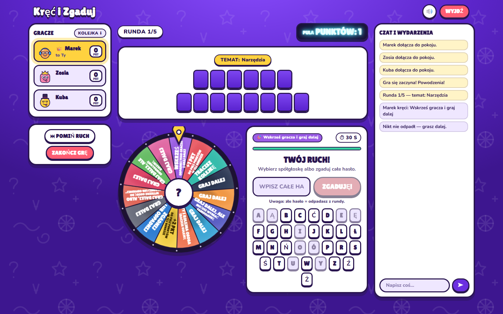
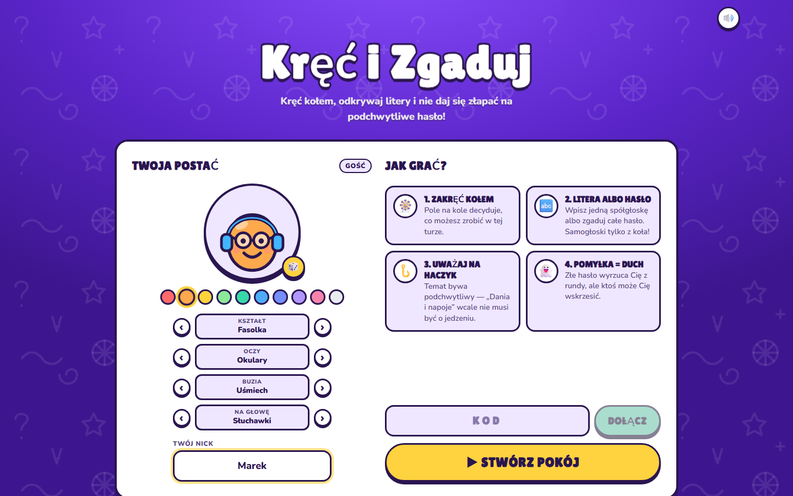
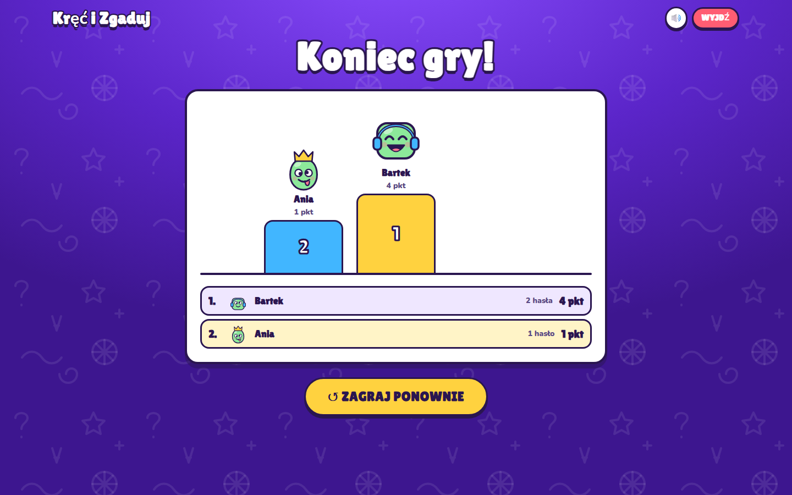

# Spinshot

Imprezowa gra przeglądarkowa dla kilku osób. Wchodzicie do wspólnej poczekalni, kręcicie kołem, odkrywacie litery i zgadujecie hasła: przysłowia, powiedzenia, tytuły filmów, piosenek i wiele innych.



## Zasady

1. Host tworzy pokój i wysyła znajomym kod albo link. Do gry potrzeba co najmniej 2 osób, a zmieści się 12.
2. Każda runda to jedno hasło z tematem. Pula punktów zaczyna się od 1.
3. W swojej turze kręcisz kołem. Wylosowane pole decyduje, co możesz zrobić.
4. Jeśli możesz grać, wpisujesz **jedną spółgłoskę** albo **zgadujesz całe hasło**. Samogłoskę wolno wybrać tylko z pola „możesz wybrać samogłoskę”. Jeśli litera jest w haśle, kręcisz jeszcze raz. Pudło oddaje kolejkę następnej osobie.
5. Złe hasło kosztuje Cię **kolejkę**. Z rundy odpadasz i zostajesz duchem 👻 tylko przy polu „Zgadnij lub odpadnij”. Jeśli odpadną wszyscy, runda kończy się bez zwycięzcy, a pula przepada.
6. Kto odgadnie hasło, zgarnia całą pulę. Odkrycie ostatniej litery też liczy się jako odgadnięcie.
7. Po ustalonej liczbie rund (3, 5, 7 albo 10) wygrywa osoba z największą liczbą punktów.

### Pola na kole

| Pole | Napis na kole | Efekt |
| --- | --- | --- |
| Graj dalej (6×) | GRAJ DALEJ | Wpisujesz spółgłoskę albo zgadujesz hasło |
| +1 / +2 pkt do puli | +1 PKT / +2 PKT DO PULI | Pula rośnie, a Ty grasz dalej |
| Graj dalej, możesz wybrać samogłoskę | SAMOGŁOSKA | W tej turze wolno Ci wpisać samogłoskę |
| Graj dalej, ale odwracamy kolejkę | ZMIANA KIERUNKU | Grasz, a potem kolejka idzie w drugą stronę |
| Tracisz kolejkę | TRACISZ KOLEJKĘ | Ruch przechodzi na następną osobę |
| Ty i kolejna osoba tracicie kolejkę | TRACISZ TY I NASTĘPNY | Następna osoba też zostaje pominięta |
| Zgadnij lub odpadnij | ZGADNIJ LUB ODPADNIJ | Musisz od razu zgadywać. Błąd albo koniec czasu oznacza, że odpadasz |
| Graj dalej albo wybierz osobę do „Zgadnij lub odpadnij” | WSKAŻ OFIARĘ | Grasz albo wskazujesz kogoś, kto musi od razu zgadywać |
| Wskrześ gracza | WSKRZEŚ GRACZA | Przywracasz ducha do gry i grasz dalej. Jeśli nikt nie odpadł, działa jak „Graj dalej” |

Host ustawia limit czasu na ruch: 15, 30, 45 albo 60 s, albo bez limitu. Gdy czas minie, gracz traci kolejkę. Przy „Zgadnij lub odpadnij” odpada. Osoba rozłączona jest pomijana po kilku sekundach, a po odświeżeniu strony wraca do pokoju automatycznie.

## Konta i postacie

- **Gość**: wpisujesz nick i od razu grasz. Postać zapisuje się w przeglądarce.
- **Konto**: logowanie przez [Clerk](https://clerk.com) (e-mail i hasło albo Google). Postać i statystyki (gry, wygrane, odgadnięte hasła, punkty) są zapisane na koncie w `publicMetadata` Clerka, więc gra nie potrzebuje bazy danych.
- **Kreator postaci**: 10 kolorów, 3 kształty, 6 rodzajów oczu, 6 buzi i 7 nakryć głowy (albo żadne). Jest też przycisk losowania.

## Uruchomienie lokalne

Wymagany jest Node.js 22.18 lub nowszy. Serwer uruchamia pliki `.ts` bezpośrednio, bez kompilacji.

```bash
npm install
cp .env.example .env   # opcjonalnie: klucze Clerka
npm run dev
```

Gra będzie pod adresem http://localhost:5173. Vite przekierowuje `/api` i `/socket.io` na serwer gry, który działa na porcie 3001.

Wersja produkcyjna:

```bash
npm run build
npm start              # http://localhost:3001
```

Inne skrypty: `npm test` uruchamia testy silnika gry (Vitest), a `npm run typecheck` sprawdza typy.

### Logowanie (Clerk)

Bez kluczy gra działa tylko w trybie gościa. Żeby włączyć konta:

1. Załóż aplikację na https://dashboard.clerk.com i włącz logowanie przez **e-mail + hasło** oraz **Google**.
2. Skopiuj klucze do `.env`:
   ```
   CLERK_PUBLISHABLE_KEY=pk_...
   CLERK_SECRET_KEY=sk_...
   ```
3. Zrestartuj serwer. Klucz publiczny trafia do przeglądarki przez `/api/config`, więc klucze ustawiasz tylko w jednym miejscu.

## Deploy

Gra potrzebuje stałych połączeń WebSocket, więc nie pójdzie na Vercelu. Nada się na przykład [Render](https://render.com) (darmowy plan), Railway albo Fly.io.

Na Renderze wybierz **New → Blueprint**, wskaż to repo, a plik `render.yaml` skonfiguruje resztę. W panelu uzupełnij tylko klucze Clerka. W `CLERK_AUTHORIZED_PARTIES` możesz podać adres swojej gry, na przykład `https://spinshot.onrender.com`.

Stan pokojów jest trzymany w pamięci serwera. Restart albo uśpienie darmowej instancji kończy trwające gry, ale konta i statystyki zostają w Clerku.

## Technologie

- **Frontend**: React 19, Vite, Tailwind CSS 4, Socket.IO client, `@clerk/react` (ładowany leniwie, więc goście go nie pobierają)
- **Backend**: Node.js, Express 5, Socket.IO, `@clerk/backend`
- **Wspólne typy i reguły** są w `shared/`. Serwer jest jedynym źródłem prawdy: hasło nigdy nie trafia do przeglądarki przed końcem rundy.

```
server/
  index.ts       HTTP + Socket.IO, pokoje, API profilu
  room.ts        silnik gry: tury, pola koła, eliminacje, timery
  passwords.ts   bank podchwytliwych haseł
  auth.ts        weryfikacja sesji Clerka, postać i statystyki w metadata
shared/          typy zdarzeń, definicja koła, polski alfabet, awatary
src/             klient React (ekrany: start, poczekalnia, gra, podium)
tests/           testy silnika gry
```

Nowe hasła dopisujesz w `server/passwords.ts`: temat jest kluczem, a pod nim lista haseł.



